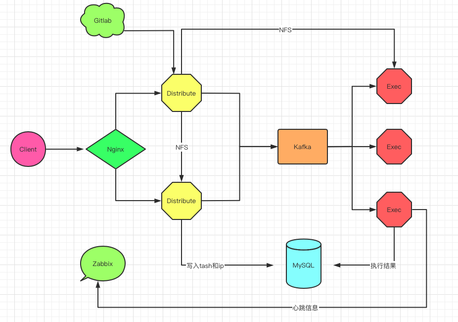

### Distribute任务分发和Execute-Engine任务执行


#### 一：项目介绍

> `(一) 功能`

- `Distribute`主要工作是完成ansible任务拆分，将拆分后的任务推送到Kafka消息队列中，并且基于task_id、ips、ip获取任务的执行进度和执行结果。

- `Execute-Engine`主要工作是完成Kafka指令集消费，执行指令集任务，将任务结果写入到MySQL数据库中。


> `(二) Distribute和Execute-Engine数据交互方式`



- 在上图中，Distribute服务为两个docker容器，目的是确保服务的高可用性。在其中一个Distribute服务中，安装了NFS，基于轻量级NFS网络文件系统，将从Gitlab上拉取的项目文件(需要配置公钥，避免输入用户名和密码)，共享给另外一个Distribute容器，同时也共享给所有的Execute-Engine执行引擎，执行引擎可以执行远程的copy任务

- 客户端发送请求有三种：`第一种是项目克隆的请求`。因为在项目部署或更新应用程序配置的时候，一般会从Gitlab上拉取满足发布要求的项目版本，或配置文件，将这些文本文件或二进制文件拉取到Distribute上

- `第二种请求是任务下发请求`，当一个任务下发以后，Distribute会基于ips字段判断需要执行任务的ip数，默认情况下，Distribute会以30个ip作为一个子单元，进而将用户下发的任务切割成若干个子任务，并且将这些子任务推送到Kafka指定的Topic中，等待已经订阅此Topic的Execute-Engine执行引擎来消费其中的Message

- `第三种请求是任务执行结果查询请求`，当任务下发完毕后，用户就可以基于任务ID或IP查询任务执行的结果。例如在Adhoc任务中，用户可以基于task_id、ips、或ip来查询单个IP或多个IP执行的结果。在Playbook任务中用户可以基于ips来获取一个Playbook执行的成功率以及最终结果

- `Execute-Engine执行引擎`从Kafka中消费的Message有两类，一类是Adhoc，另一类是Playbook，Execute-Engine是一个Daemon守护进程，一旦程序启动后，会开启两个子进程，一个进程主要是消费Kafka中Message，另外一个是向Zabbix的Server端或Proxy端发送TCP心跳包

> `(三) 优势对比`

- **1：对比传统Ansible执行命令和Jenkins中执行Ansible脚本，Distribute和Execute-Engine组合给用户带来的便利有如下几个方面**

	- ①：当Ansible在上千台或上万台主机上执行任务的时候，经常由于其中的一台或几台系统盘IO故障，无结果返回而卡死，或者Ansible子进程中线程池无法获取线程对象执行的返回结果而进入死循环，并且无法知道是其中哪些主机出问题，从而浪费大量的故障排查时间

	- ②：在Jenkins页面中，当执行一个Job任务，Job任务中调用Ansible插件，如果被执行任务的主机数量众多，Jenkins执行日志页面也会由于Ansible任务的卡死而陷入到无限等待中，导致其他的Jenkins任务无法执行


- **2：为了解决上述问题，`Distribute和Execute-Engine`从两个方面对Ansible任务的执行进行了优化：**

	- ①：引入任务Unit子单元，在Distribute中将成千上万的IP切割为多个小任务，避免了大批量主机执行任务卡死的情况


	- ②：给每个任务添加超时时间，在规定的超时时间内，没有任务结果返回，程序将会立马终止任务，任务执行结果会记录到数据库中，从而可以非常方便的找出是哪些主机有问题，无法顺利执行任务。

	- ③：执行引擎的执行能力会由Execute-Engine部署的数量线性提高


#### 二：部署安装

> `(一) 克隆项目`

```
# 拉取distribute
git clone https://github.com/yinhuanyi/distribute.git

# 拉取Execute-Engine
git clone https://github.com/yinhuanyi/execute-engine.git
```

> `(二) 项目部署`

- 部署(确保主机上已经安装了docker环境)

```
# 1：切换到项目目录
cd fil-distribute

# 2：修改配置文件
vi conf/server.conf

# 3：修改私钥，用于从git上来取代码
vi  id_rsa
```